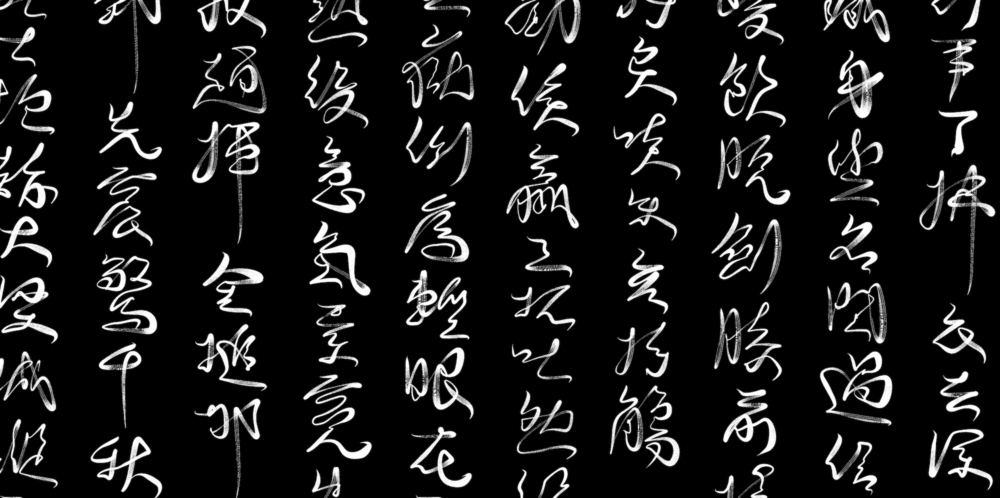
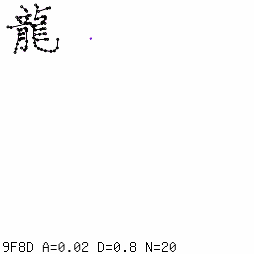
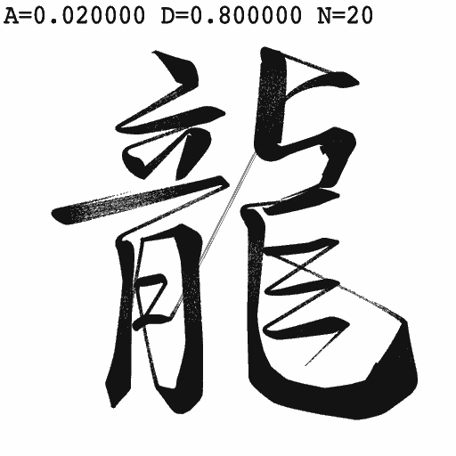
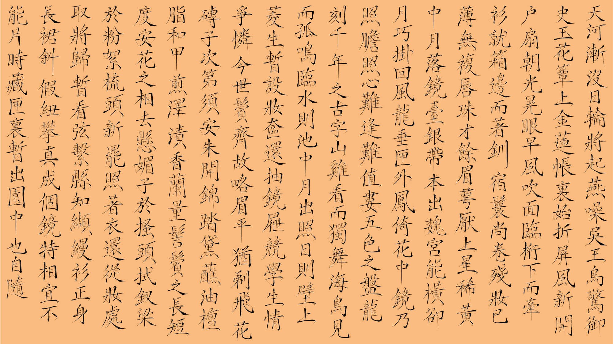
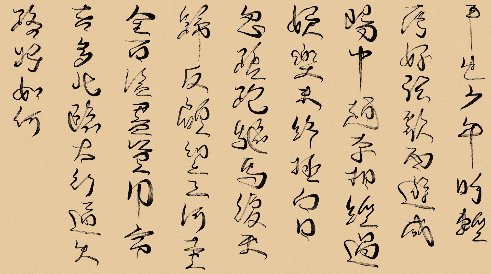
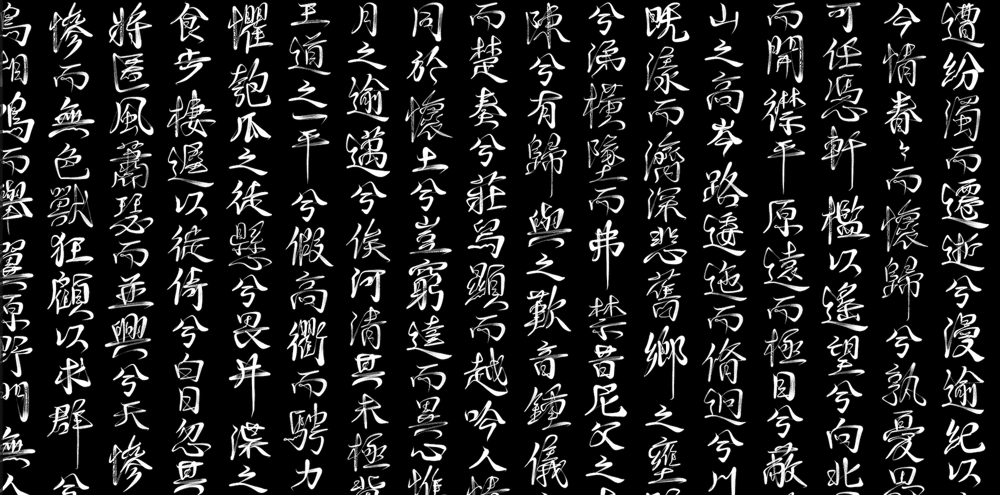
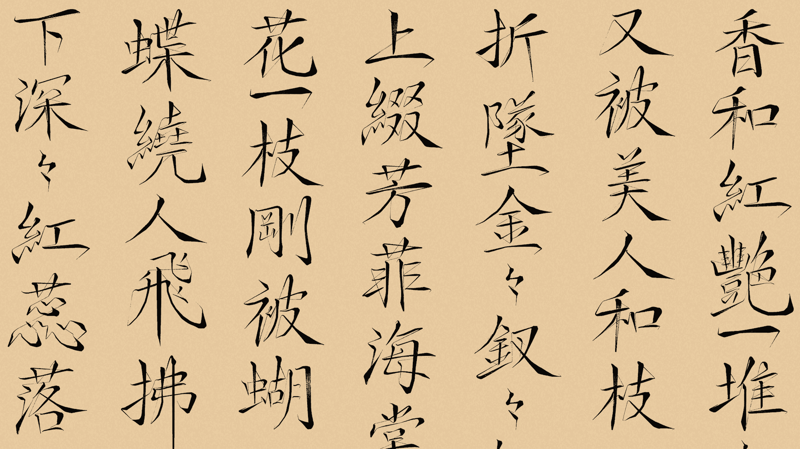
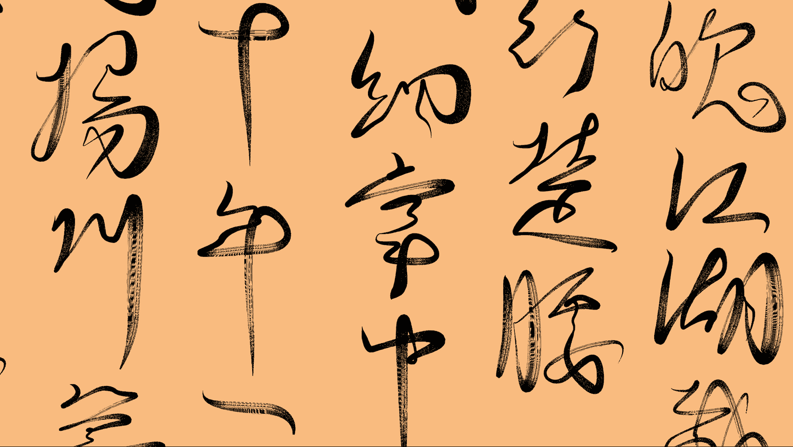

# Computer Grass 

Algorithmically generated typefaces simulating Chinese calligraphy. A parametric brushstroke physics system is applied to [MakeMeAHanzi](https://github.com/skishore/makemeahanzi) character skeleton dataset to automatically imitate various script styles, such as regular script, running script, and grass script.

真書之骨，假草之勢。原非其法，庶擬其意。抱愧古者，因命之曰**擬草體**。

**The TrueType Fonts can be [downloaded](https://github.com/LingDong-/computer-grass/releases) for free personal use and free commercial use**. See COPYING.txt for details. 

| | |
|---|---|
|  |  |


## Instructions

You can download the fonts with preset styles from [Releases](https://github.com/LingDong-/computer-grass/releases). The fonts can be used with any program that supports TTF format. They're best set with top-to-bottom (TTL) layout.

- [ComputerGrassRegular.ttf](https://github.com/LingDong-/computer-grass/releases) 擬草體·楷
- [ComputerGrassRunning.ttf](https://github.com/LingDong-/computer-grass/releases) 擬草體·行
- [ComputerGrassGrass.ttf](https://github.com/LingDong-/computer-grass/releases) 擬草體·草

### Generate from Scratch

- Install the [Dither programming language](https://github.com/LingDong-/dither-lang), and node.js
- Preset script styles configs are available, e.g. `cfg.grass.json`. To create your own, copy one of the `cfg.*.json`, rename the `*` part and change the parameters.
- Run `make [style]` (e.g. `make grass`) to build the font. Use `make all` to build all three presets, or substitute `[style]` with the name of your own config.
- To preview a visualization of the generation process without writing to files, use (e.g.): 

```
dither -xvt c grass.dh show cfg.running.json
```

### Parameters / How it works

In `cfg.*.json`:

- `*_needle`: control extension of finishing vertical stroke;
- `preshrink`, `slant`, `pincushion`: distort character skeleton toward handwritten look away from printed look;
- `*_spread_*`: structure/complexity-based relative scaling of character skeletons;
- `accel`, `damp`: physics simulation of the brush being pulled by a virtual target;
- `overtime`, `fpstroke`: control speed with which the skeleton is traced by the virtual target;
- `*_dip`, `*_z`: controls wetness and thickness of ink.

That's it! A very straightforward system.

## Gallery

All samples below (as well as the banner image) are typeset with fonts created with the same algorithm under different parameters.








## Known Limitations

- All script styles uses the same stroke order, inherited from the MakeMeAHanzi dataset. In real calligraphy, sometimes characters have different stroke order depending on style.
- In real grass script, there are often accepted (but non-obvious) ways to abstract certain characters and radicals, which the system lacks data for.
- As all characters are batch processed with the same rules + physics-based system, some characters can have minor defects or appear less aesthetically pleasing than others.

Obviously it is difficult to match the artistic and aesthetic value of calligraphic masterpieces in history. Nevertheless the author believes that the program presents interesting techniques and results, and with additional manual labelling of data, or with a semi-automated workflow, most shortcomings may very well be overcome.

-------

The project is written from scratch by hand in [Dither](https://github.com/LingDong-/dither-lang), a new programming language for creative coding, developed by the author at MIT Media Lab. The name of the project is inspired by the title of the essay ["Computer Grass is Natural Grass"](https://www.atariarchives.org/artist/sec5.php), the name of the font ["Computer Modern"](https://en.wikipedia.org/wiki/Computer_Modern), and the fact that it is a computer font for grass script.